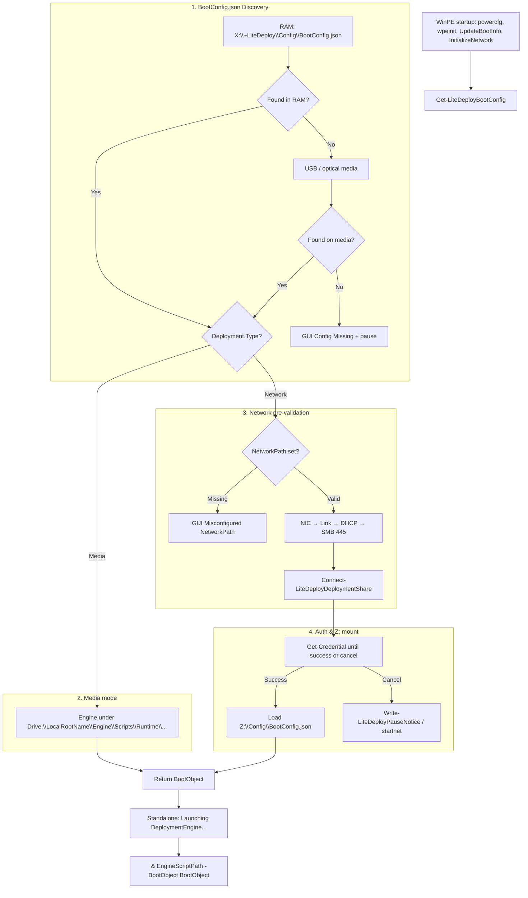

# LiteDeploy WinPE Initialization Engine Documentation

**Production script**: `Engine\Scripts\Runtime\010-BootInitializer\LiteDeploy.BootInitializer.ps1`  
**Draft (current design)**: `Engine\Scripts\Runtime\010-BootInitializer\LiteDeploy.BootInitializer.Draft.ps1`  
**Documentation**: `Engine\Scripts\Runtime\010-BootInitializer\README.md`  
**Target Environment**: Windows PE (WinPE 5.1 / 10 / 11) & Windows Host  
**PowerShell Version**: PowerShell 5.1+ (`Set-StrictMode -Version 2.0`)  

> This README describes the **draft** behavior. Promote the draft over the production script when ready to ship.

---

## 1. Overview & Purpose

BootInitializer is the WinPE entry component for **LiteDeploy**. It:

1. Discovers `BootConfig.json`
2. Validates network when `Deployment.Type` is `Network`
3. Prompts for credentials and maps the deployment share to `Z:\` (network mode)
4. Loads full deployment configuration from the share when available
5. Builds a `BootObject` and launches `LiteDeploy.DeploymentEngine.ps1`

The WinPE ISO / `Boot.wim` is typically built with [WinPEBuilder](https://github.com/cmartinezone/WinPEBuilder) for USB/ISO or WDS/PXE.

---

## 2. Architecture & Execution Flow



---

## 3. Configuration Discovery

Internal SATA / NVMe / RAID volumes are excluded.

| Priority | Scope | Paths |
| :--- | :--- | :--- |
| **1** | WinPE RAM | `$env:SystemDrive\~LiteDeploy\Config\BootConfig.json` only |
| **2** | External media | `<Drive>:\~LiteDeploy\Config\BootConfig.json` and `<Drive>:\*\Config\BootConfig.json` |

### Layouts by mode

| Mode | Deployment configuration | DeploymentEngine |
| :--- | :--- | :--- |
| **Network (`Z:`)** | `Z:\Config\BootConfig.json` | `Z:\Engine\Scripts\Runtime\LiteDeploy.DeploymentEngine.ps1` |
| **Media (USB)** | `<Drive>\<LocalRootName>\Config\BootConfig.json` | `<Drive>\<LocalRootName>\Engine\Scripts\Runtime\LiteDeploy.DeploymentEngine.ps1` |

`Deployment.LocalRootName` defaults to `~LiteDeploy`. If the USB folder name changes (e.g. `DeploymentMedia`), set `LocalRootName` in `BootConfig.json` manually. Discovery may still find the file via wildcard; engine/content resolution follows `LocalRootName`.

---

## 4. Network Pre-Validation

When `Deployment.Type` is `"Network"` and `NetworkPath` is set:

1. **NIC** — `Get-NetAdapter` with `.NET` fallback  
2. **Link** — cable / operational Up  
3. **DHCP** — up to 30s poll; early exit on first valid IPv4 (skips loopback/APIPA)  
4. **SMB 445** — UNC normalized; TCP connect with 5000ms timeout  

Retry/Cancel GUI for steps 1–4 uses `Invoke-LiteDeployGuiRetry` (optional `wpeutil InitializeNetwork` + retry log).

---

## 5. Credentials & Drive Mapping

* Clears stale `Z:` with `net use Z: /delete /y` and `Remove-PSDrive`
* Maps with `New-PSDrive` (fallback `New-SmbMapping`)
* CredUI message (no UNC in the dialog):  
  `Please enter your username and password to connect to the deployment share.`
* Full UNC is shown on the console CHECK line before the prompt
* Auth retries until success or Cancel (console only; no Retry/Cancel GUI)
* Cancel → `Write-LiteDeployPauseNotice` (`startnet`)

### Console messages (mount)

```
 [CHECK]   Connecting to deployment share '\\Server\Share$'...
 [SUCCESS] Connected to deployment share '\\Server\Share$' on Z:\.
 [SUCCESS] Deployment share '\\Server\Share$' is already connected to Z:\.
 [SUCCESS] Loaded deployment configuration from 'Z:\Config\BootConfig.json'.
 [WARNING] Deployment configuration was not found on the share; continuing with current settings.
 [INFO]    Launching DeploymentEngine...
```

---

## 6. BootObject (passed to DeploymentEngine)

`Get-LiteDeployBootConfig` returns a `PSCustomObject` launched as:

```powershell
& $enginePath -BootObject $bootObj
```

Important properties include:

| Property | Purpose |
| :--- | :--- |
| `Config` / `ConfigPath` / `ConfigFound` | Parsed BootConfig and path |
| `IsWinPE` | MiniNT registry detection |
| `DeploymentType` | `Network` or `Media` |
| `LocalRootName` | Media folder root name |
| `EngineScriptPath` | Path to DeploymentEngine |
| `NetworkPath` / `ServerName` / `ServerReachable` | Share targeting |
| `ShareMounted` / `DriveLetter` / `Credential` | Mount result |
| `IPAddress` / `NetworkAdapterName` / … | Network diagnostics |
| `AppName` / `AppVersion` / `Environment` | From config Metadata when present |

---

## 7. Function Reference

| Function | Role |
| :--- | :--- |
| `Write-LiteDeployLog` | Console + CMTrace log |
| `Write-LiteDeployPauseNotice` | Logged pause + `startnet` guidance |
| `Show-LiteDeployGuiError` | MessageBox OK or Retry/Cancel |
| `Invoke-LiteDeployGuiRetry` | Shared network retry loop helper |
| `Format-LiteDeployUncPath` | Normalize UNC |
| `Resolve-LiteDeployEnginePath` | Engine path by `DeploymentType` |
| `Get-LiteDeployRuntimeConfig` | Load `Z:\Config\BootConfig.json` (network) |
| `Test-LiteDeployNetworkHardware` | NIC + link |
| `Test-LiteDeployIPAddress` | DHCP poll |
| `Test-LiteDeployDeploymentShare` | SMB 445 |
| `Connect-LiteDeployDeploymentShare` | Credentials + `Z:` |
| `Get-LiteDeployBootConfig` | Full discovery + validation → BootObject |
| `Get-LiteDeployComponentMetadata` | Component id/version (`-Metadata` fast exit) |

```powershell
Resolve-LiteDeployEnginePath -RootPath "Z:" -DeploymentType Network
# Z:\Engine\Scripts\Runtime\LiteDeploy.DeploymentEngine.ps1

Resolve-LiteDeployEnginePath -RootPath "D:" -LocalRootName "DeploymentMedia" -DeploymentType Media
# D:\DeploymentMedia\Engine\Scripts\Runtime\LiteDeploy.DeploymentEngine.ps1
```

---

## 8. Standalone Launcher

When run directly (not dot-sourced):

1. Calls `Get-LiteDeployBootConfig` (standalone currently forces mount + GUI errors)
2. If Media **or** share mounted → resolve/launch DeploymentEngine
3. On success logs: `[INFO] Launching DeploymentEngine...`
4. On engine missing:  
   * Console: `[ERROR] DeploymentEngine was not found on the deployment source.`  
   * GUI includes the full expected path  
5. Failures / incomplete init → `Write-LiteDeployPauseNotice`

WinPE also runs `wpeutil UpdateBootInfo` at startup (registry PE boot info reserved; not added to BootObject yet).

---

## 9. Logging & Diagnostics

* **Log file**: `X:\~LiteDeploy\WorkLogs\LiteDeploy.Execution.log`
* **Format**: CMTrace XML (`type` 1 = info/success, 2 = warning/retry/notice, 3 = error)
* **Time**: local clock + real UTC offset minutes
* **`file=`**: running script leaf name
* **Banner version**: from `Get-LiteDeployComponentMetadata`

### Logged

`[INIT]`, `[CHECK]`, `[SUCCESS]`, `[INFO]`, `[WARNING]`, `[RETRY]`, `[ERROR]`, `[NOTICE]` / `startnet`, DHCP wait start (`[INFO] Waiting for DHCP (up to 30s)...`), auth cancel, config load/missing, launch, engine missing/fail.

### Not logged (console only)

* Per-second `[DHCP] Waiting... (Ns remaining)` countdown ticks  
* Blank spacer lines  

### Tags

| Tag | Meaning |
| :--- | :--- |
| `[INIT]` | WinPE / power plan |
| `[CHECK]` | Discovery / validation step |
| `[SUCCESS]` | Step completed |
| `[INFO]` | Mode, DHCP wait, launch |
| `[WARNING]` | Recoverable issue |
| `[RETRY]` | Retrying a step |
| `[ERROR]` | Failure |
| `[NOTICE]` | Init paused; run `startnet` |

---

## 10. Perfect Success (Network) — console sketch

```
==========================================================================
            LiteDeploy WinPE Initialization Engine v1.0.0
==========================================================================

 [INIT]    WinPE Environment & High Performance Power Plan initialized.

 [CHECK]   Searching for BootConfig.json...
 [SUCCESS] BootConfig.json discovered at 'X:\~LiteDeploy\Config\BootConfig.json'.
 [INFO]    Deployment Mode: Network (Share: \\Server\DeploymentShare$).

 [CHECK]   Scanning for Network Hardware Adapters...
 [SUCCESS] Adapter Found: 'Intel(R) Ethernet Connection'.

 [CHECK]   Verifying Network Link Connection...
 [SUCCESS] Network Link Active (Cable Connected).

 [CHECK]   Polling IPv4 / IPv6 Address Assignment...
 [INFO]    Waiting for DHCP (up to 30s)...
 [SUCCESS] IP Address Assigned: 10.0.0.25

 [CHECK]   Testing SMB Connectivity to Server 'Server' (Port 445)...
 [SUCCESS] Server 'Server' is Reachable over SMB Port 445.

 [CHECK]   Connecting to deployment share '\\Server\DeploymentShare$'...
 [SUCCESS] Connected to deployment share '\\Server\DeploymentShare$' on Z:\.
 [SUCCESS] Loaded deployment configuration from 'Z:\Config\BootConfig.json'.
 [INFO]    Launching DeploymentEngine...
```

Media success skips network/auth and goes from mode info to `[INFO] Launching DeploymentEngine...`.
