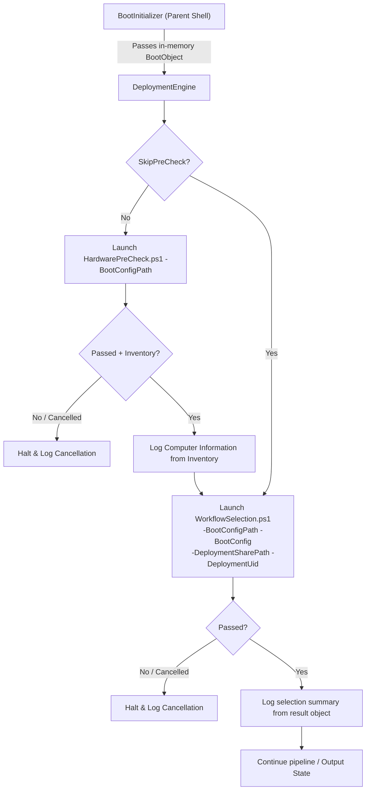

# LiteDeploy Deployment Engine Module Documentation

**Script File**: `Engine\Scripts\Runtime\020-DeploymentEngine\LiteDeploy.DeploymentEngine.ps1`  
**Draft**: `LiteDeploy.DeploymentEngine.Draft.ps1` (BootConfigPath pipeline + inventory logging)  
**Documentation File**: `Engine\Scripts\Runtime\020-DeploymentEngine\README.md`  
**Target Environment**: Windows PE (WinPE 5.1 / 10 / 11)  
**PowerShell Version**: PowerShell 5.1+ (`Set-StrictMode -Version 2.0`)  

---

## 1. Overview & Purpose

`LiteDeploy.DeploymentEngine.ps1` is the central runtime pipeline orchestrator for **LiteDeploy Core**.

It executes in WinPE immediately following `BootInitializer`, coordinating the sequenced transitions across deployment phases:
1. **Phase 1: Pre-Flight Assessment (`HardwarePreCheck`)** — Calls `LiteDeploy.HardwarePreCheck.ps1 -BootConfigPath <BootObject.ConfigPath>` (sibling `LiteDeploy.HardwarePreCheck.UI.xaml` required after SyncComponents). Validates network, storage, firmware, TPM; returns `{ Passed, Inventory }`. On success the Draft engine logs MDT-style computer information from that inventory (see below).
2. **Phase 2: Workflow & Identity Selection (`WorkflowSelection`)** — Calls `LiteDeploy.WorkflowSelection.ps1` with `-BootConfigPath`, optional `-BootConfig`, `-DeploymentSharePath`, and `-DeploymentUid` (`Get-LiteDeployUid`). Collects computer identity, OS workflow (catalog), target disk (`Get-HardwarePhysicalDisks` / capacity gate), and drivers (imported `LiteDeploy.DriverStaging`; OEM Info dialog; media online only when internet is reachable; browse BFS depth 8). On confirm: stores `SelectionData`, logs short summary from the result (`WorkflowSelection confirmed` + Workflow / Computer|Disk / Drivers), continues to Phase 3. Unhandled throws bubble to BootInitializer (`[NOTICE]` / `startnet`).
3. **Phase 3: Disk Preparation (`DiskPreparation`)** — Wipes and partitions target disk (UEFI/GPT or Legacy/MBR), mounts temporary staging volume, and stamps WinRE flags.
4. **Phase 4: OS Image Application (`OSInstallation`)** — Generates customized `X:\unattended.xml` from `Autopilot.xml` template and executes `setup.exe /NoReboot`.
5. **Phase 5: Execution Handoff & Summary** — Aggregates and verifies pipeline outputs before offline staging handoff.

---

## 2. Component Metadata

```powershell
Get-LiteDeployComponentMetadata
```

| Property | Value |
| :--- | :--- |
| **ComponentId** | `DeploymentEngine` |
| **Name** | `LiteDeploy Deployment Engine` |
| **Version** | `1.0.0` |
| **Category** | `Runtime` |
| **TargetEnvironment** | `WinPE` |
| **MinPowerShellVersion** | `5.1` |
| **Author** | `LiteDeploy Team` |
| **Dependencies** | `LogWriter`, `Hardware`, `HardwarePreCheck`, `WorkflowSelection`, `DiskPreparation`, `OSInstallation`, `Progress` |

---

## 3. Parameters

| Parameter | Type | Default | Description |
| :--- | :--- | :--- | :--- |
| `-BootObject` | `[psobject]` | `$null` | In-memory bootstrap context containing share mount status, credentials, and drive mappings. |
| `-SkipPreCheck` | `[switch]` | `$false` | Skips Phase 1 and directly launches Phase 2 (useful for rapid testing / re-deployments). |
| `-Metadata` | `[switch]` | `$false` | Fast-exit switch returning the standard `PSCustomObject` metadata. |

---

## 4. Pipeline Flow & State Management



### Phase logs (console + CMTrace)

| Phase | Pass (examples) |
| :--- | :--- |
| 1 PreCheck | `Phase 1: Launching…` then `Phase 1: System Readiness Pre-Check completed successfully.` |
| 2 Workflow | `WorkflowSelection confirmed.` + `Workflow:` / `Computer: … \| Disk …` / `Drivers: …` |
| Drivers (during wizard) | DriverStaging: `Driver catalog loaded.` then optional `Driver pack: {MatchBy} \| Content\|Archive \| {PackModel}` (no line when no match) |

### Draft: computer information log

After HardwarePreCheck passes, `LiteDeploy.DeploymentEngine.Draft.ps1` writes a CMTrace/console block from `$preCheckResult.Inventory` (empty fields skipped):

| Log label | Inventory source |
| :--- | :--- |
| Make / Model / Serial Number / UUID / Asset Tag | `Vendor`, `Model`, `SerialNumber`, `UUID`, `AssetTag` |
| Chassis / Architecture | `Chassis`, `Architecture` |
| Memory / Processor | `MemoryGB`, `ProcessorName` |
| Firmware / Secure Boot / TPM | `FirmwareType`, `SecureBootDisplay`, `TpmVersion` + `TpmState` |
| Network Adapter / MAC | `PrimaryNicName` (or `NetworkAdapter`), `PrimaryMacAddress` |
| IPv4 | `IPv4Cidr` when known (`x.x.x.x/24`), else `IPAddress` |
| IPv6 | `IPv6Address` |
| DNS | `DnsServers` (comma-separated) |
| Disk 0, Disk 1, … | One line per `HardDrives[]` / `Disks[]` (model + size) |

`Write-LiteDeployEngineLog` supports `-NoConsole` (forwarded to LogWriter) for file-only verbose dumps; the computer-information block currently prints to the console as well.

---

## 5. Deployment UID & State Management

Each session receives a cryptographically randomized, compact, date-prefixed identifier:
```powershell
function Get-LiteDeployUid {
    $bytes = [Byte[]]::new(2)
    [System.Security.Cryptography.RandomNumberGenerator]::Create().GetBytes($bytes)
    $hex = [System.BitConverter]::ToString($bytes) -replace '-'
    return "$((Get-Date).ToString('yyMMdd'))-$hex"
}
```

The returned and persisted `$Deployment` state object (`X:\~LiteDeploy\DeploymentState.json`):

```powershell
[PSCustomObject]@{
    DeploymentUid   = "260929-A3F1"
    Status          = "ReadyForDeployment"    # Initializing, HardwarePreCheck, WorkflowSelection, ReadyForDeployment, Staging, Completed, Cancelled, Failed
    CurrentPhase    = 2
    StartTime       = "2026-09-29T22:55:00.000Z"
    EndTime         = $null
    BootObject      = $BootObject
    HardwarePreCheck        = [PSCustomObject]@{
        Passed         = $true
        CompletedTime  = "2026-09-29T22:55:10.000Z"
    }
    Workflow        = [PSCustomObject]@{
        Confirmed      = $true
        SelectionData  = $workflowOutput
        CompletedTime  = "2026-09-29T22:55:30.000Z"
    }
    Disk            = [PSCustomObject]@{
        Formatted      = $true
        DiskNumber     = 0
        OSDriveLetter  = "W:\"
        CompletedTime  = "2026-09-29T22:56:00.000Z"
    }
    OSInstall       = [PSCustomObject]@{
        Applied        = $true
        Engine         = "Setup.exe"
        SetupPath      = "Z:\Content\OS\setup.exe"
        UnattendPath   = "X:\unattended.xml"
        ExitCode       = 0
        DurationSeconds= 210
        CompletedTime  = "2026-09-29T22:59:30.000Z"
    }
    Execution       = [PSCustomObject]@{
        CurrentStep    = "Initialized"
        PercentComplete = 70
        LocalLogDir    = "X:\~LiteDeploy\WorkLogs"
        Errors         = @()
    }
}
```

---

## 6. Verification & CLI Usage

To inspect component metadata:
```powershell
powershell -ExecutionPolicy Bypass -File ".\Engine\Scripts\Runtime\020-DeploymentEngine\LiteDeploy.DeploymentEngine.ps1" -Metadata
```

To run full deployment pipeline:
```powershell
powershell -STA -ExecutionPolicy Bypass -File ".\Engine\Scripts\Runtime\020-DeploymentEngine\LiteDeploy.DeploymentEngine.ps1" -BootObject $bootObj
```
