# LiteDeploy Hardware PreCheck — execution flowchart

Lifecycle of **production** PreCheck ([`LiteDeploy.HardwarePreCheck.ps1`](LiteDeploy.HardwarePreCheck.ps1) + [`LiteDeploy.HardwarePreCheck.UI.xaml`](LiteDeploy.HardwarePreCheck.UI.xaml)).

Reference only: [`SingleFile/LiteDeploy.HardwarePreCheck.ps1`](SingleFile/LiteDeploy.HardwarePreCheck.ps1) — same flow with inlined markup (not Engine-wired).

---

## Flowchart

```mermaid
flowchart TD
    Start["Launch with -BootConfigPath<br/>optional -BootConfig"] --> CheckSTA{"Apartment == STA?"}

    subgraph Initialization ["1. Environment and WPF host"]
        CheckSTA -- "No" --> RelaunchSTA["Relaunch powershell.exe -STA -File<br/>forward -BootConfigPath only"]
        CheckSTA -- "Yes" --> ImportHw["Import-Module LiteDeploy.Hardware.ps1<br/>if Get-HardwareInventory missing"]
        ImportHw --> ResolveTheme["Theme: -Theme or BootConfig.Ui.Theme or Light<br/>peek object/path; do not consume one-shot -BootConfig"]
        ResolveTheme --> ForceSoftwareRender["RenderMode = SoftwareOnly"]
        ForceSoftwareRender --> CalcScale["Window ~70% screen height; 800x600 Viewbox"]
        CalcScale --> LoadXaml["Load LiteDeploy.HardwarePreCheck.UI.xaml<br/>replace {{palette}} tokens"]
        LoadXaml --> BrandEarly["Fill TxtBrand / TxtSubtitle from Metadata<br/>empty XAML placeholders"]
        BrandEarly --> PaintUI["ShowDialog; ContentRendered starts assessment"]
    end

    subgraph ConfigResolution ["2. BootConfig and policy"]
        PaintUI --> EffectiveConfig{"ReloadFromDisk<br/>or no -BootConfig?"}
        EffectiveConfig -- "No first paint" --> UseObject["Use optional -BootConfig once"]
        EffectiveConfig -- "Yes" --> LoadPath["Load JSON from BootConfigPath"]
        UseObject --> ApplyMeta["Brand + subtitle from Metadata<br/>Name / Environment / Version"]
        LoadPath --> ApplyMeta
        ApplyMeta --> ShowDevice["Header right: Loading device information...<br/>then raw Make / Model: … + Serial: … / SKU: …"]
        ShowDevice --> ModeShare["Deployment Mode + SMB 445 when Network"]
        ModeShare --> CheckBypass{"SkipHardwarePreCheck / SkipPreCheck?"}
        CheckBypass -- "Yes" --> PolicyBypass["95% Finalizing hardware details<br/>100%: Device PreCheck Skipped.<br/>Banner: DEVICE PRECHECK SKIPPED BY POLICY<br/>Unlock Continue; Passed=true"]
        CheckBypass -- "No" --> AssessmentPipeline["9-point readiness assessment"]
    end

    subgraph Assessment ["3. Assessment pipeline"]
        AssessmentPipeline --> Check1["1. Deployment Mode"]
        Check1 --> Check2["2. Deployment Server SMB"]
        Check2 --> Check3["3. Primary Network Adapter"]
        Check3 --> Check4["4. IPv4 / IPv6"]
        Check4 --> Check5["5. Internal Storage all disks"]
        Check5 --> Check6["6. System RAM"]
        Check6 --> Check7["7. BIOS Mode UEFI/Legacy"]
        Check7 --> Check8["8. Secure Boot"]
        Check8 --> Check9["9. TPM Status (stay at 95%)"]
    end

    subgraph Evaluation ["4. Results and return"]
        Check9 --> BuildInv["95%: Finalizing hardware details<br/>Get-HardwareInventory -Assessment -Results"]
        BuildInv --> EvalResults{"Critical FAIL and HaltOnFailure?"}
        EvalResults -- "No" --> PassState["100%: Device PreCheck Completed.<br/>Banner: DEVICE READY FOR IMAGE DEPLOYMENT<br/>Enable Continue"]
        EvalResults -- "Yes" --> FailState["100%: Device PreCheck Completed.<br/>Banner: DEVICE PRECHECK FOUND ISSUES<br/>Disable Continue"]
    end

    subgraph UserInteraction ["5. User actions"]
        PassState --> WaitAction["Await action"]
        FailState --> WaitAction
        PolicyBypass --> WaitAction

        WaitAction -- "Continue" --> ReturnOk["Close; return Passed + Inventory"]
        WaitAction -- "Run Again or F5" --> Restart["Reload BootConfig from path<br/>Reset UI: Running... + DEVICE PRECHECK IS RUNNING...<br/>Invoke-HardwarePreCheck -ReloadFromDisk"]
        Restart --> EffectiveConfig
        WaitAction -- "Open CMD" --> OpenCMD["Topmost=false; start cmd.exe"]
        WaitAction -- "Close / Esc" --> ConfirmClose{"Close PreCheck and cancel this deployment?"}
        ConfirmClose -- "No" --> WaitAction
        ConfirmClose -- "Yes" --> ReturnFail["Passed=false + Inventory"]
    end
```

---

## Section notes

### 1. Environment and WPF host
- STA relaunch forwards `-BootConfigPath` (named params are not in `$args`). Optional `-BootConfig` does not cross process.
- Hardware module is required; discovery is not duplicated inside Precheck.
- Theme is resolved before XAML colors are baked in.
- Production loads sibling `LiteDeploy.HardwarePreCheck.UI.xaml` and replaces `{{var}}` palette tokens; SingleFile embeds the same markup inline.
- Brand/subtitle XAML placeholders are empty; filled before show and again during assessment.

### 2. BootConfig and policy
- Mandatory `-BootConfigPath`; optional `-BootConfig` for first paint only.
- **F5** / **Run Again** always reload from path.
- Skip flags still produce inventory for Engine / later stages.

### 3. Assessment
- Disks: one grid row per internal disk; pass if any meets minimum.
- NICs: UI shows primary; full list on `Inventory.NICs`.
- Inventory also carries `IsVM`, `IPv4Cidr`, `IPv6Address`, and `DnsServers` for Engine logging.
- TPM / low RAM are soft (WARN) unless policy hard-fail is added later.
- Progress stays at **95%** while inventory is assembled; **100%** and banner color change together.

### 4. Return contract
- Object: `{ Passed, Inventory }`
- DeploymentEngine logs computer information from `Inventory`, then owns WorkflowSelection.

### 5. UI copy (authoritative)

Naming: **Hardware PreCheck** = product/screen; **Device PreCheck** / **DEVICE PRECHECK** = per-device status.

| Element | Text |
| :--- | :--- |
| Window title | `{ComponentMetadata.Name} v{ComponentMetadata.Version}` |
| Page headline | `Hardware PreCheck` |
| Results section | `PRECHECK RESULTS` |
| Grid columns | **STATUS** / **CHECK** / **DETAILS** |
| Brand (`TxtBrand`) | `Metadata.Name` or `LiteDeploy` |
| Subtitle | `{Environment} Environment \| v{Version}` or component `Name \| v{Version}` |
| Device identity (loading) | `Loading device information...` |
| Device identity (done) | `{Vendor} {Model}` |
| Serial / SKU | `Serial: {number} / SKU: {sku}` |
| Device identity (empty) | `Device information: unavailable` |
| Buttons | **Open CMD**, **Run Again**, **Continue** |
| Continue while running | **Running...** (`MinWidth="110"`) |
| Running banner | `DEVICE PRECHECK IS RUNNING...` |
| Passed banner | `DEVICE READY FOR IMAGE DEPLOYMENT` |
| Failed banner | `DEVICE PRECHECK FOUND ISSUES` |
| Skipped banner | `DEVICE PRECHECK SKIPPED BY POLICY` |
| Under headline @ 100% (Passed/Failed) | `Device PreCheck Completed.` |
| Under headline @ 100% (Skipped) | `Device PreCheck Skipped.` |
| Under headline @ 95% (inventory) | `Finalizing hardware details...` |
| Under headline @ 5% | `Loading configuration...` |
| Close confirm | `Close PreCheck and cancel this deployment?` |
| Refresh | **F5** = **Run Again** (path reload) |
