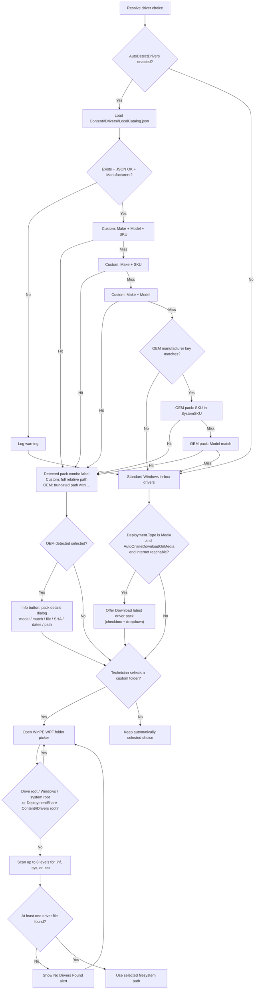
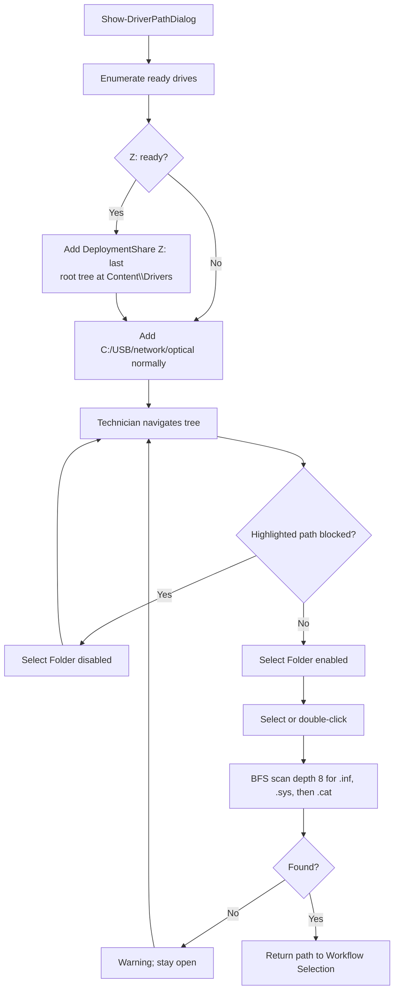
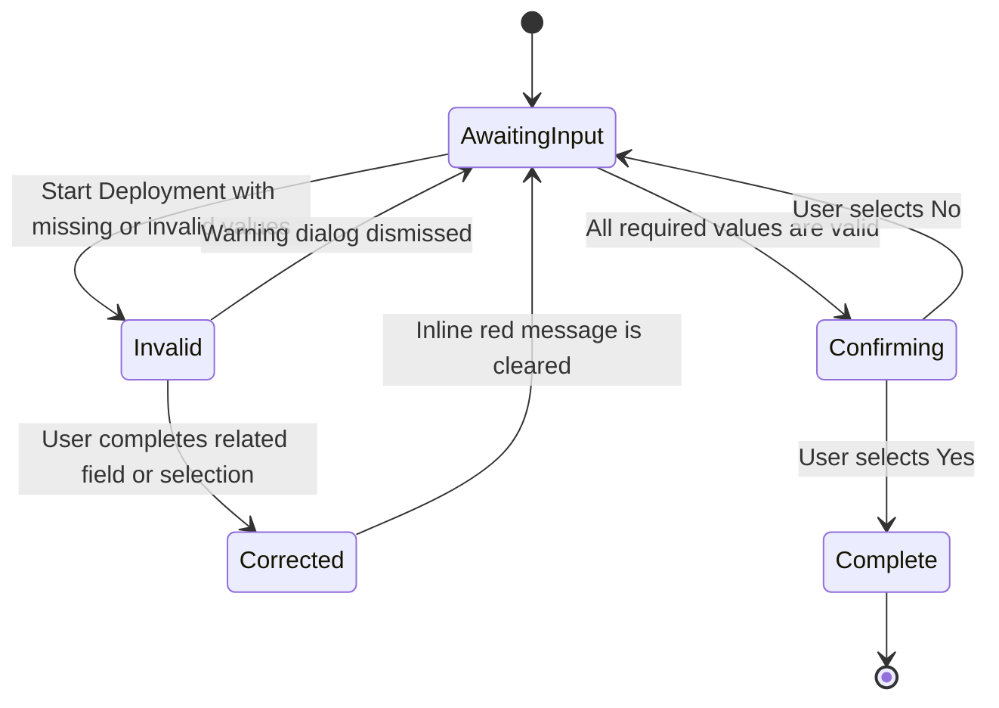

# LiteDeploy Workflow Selection Execution and Architecture Flowchart

This document visualizes the execution lifecycle of **production** Workflow Selection ([`LiteDeploy.WorkflowSelection.ps1`](LiteDeploy.WorkflowSelection.ps1) + [`LiteDeploy.WorkflowSelection.UI.xaml`](LiteDeploy.WorkflowSelection.UI.xaml)) and DriverPicker ([`LiteDeploy.WorkflowSelectionDriverPicker.ps1`](LiteDeploy.WorkflowSelectionDriverPicker.ps1) + [`LiteDeploy.WorkflowSelectionDriverPicker.UI.xaml`](LiteDeploy.WorkflowSelectionDriverPicker.UI.xaml)).

Reference only: [`SingleFile/`](SingleFile/) — same flow with inlined markup (not Engine-wired).

Engine contract: mandatory `-BootConfigPath`, optional `-BootConfig`, mandatory `-DeploymentSharePath` (`Root` / `DeploymentRoot`), optional `-DeploymentUid`.

---

## Main execution flow

```mermaid
flowchart TD
    Start["Launch LiteDeploy.WorkflowSelection.ps1<br/>-BootConfigPath + optional -BootConfig<br/>-DeploymentSharePath + optional -DeploymentUid"] --> STA{"Thread is STA?"}

    subgraph Init ["1. WinPE and UI Initialization"]
        STA -- No --> Relaunch["Relaunch powershell.exe -STA<br/>forward paths + DeploymentUid; object not passed"]
        Relaunch --> ExitOriginal["Exit original process"]
        STA -- Yes --> WPF["Load WPF assemblies and force software rendering"]
        WPF --> Alerts["Load Windows Forms alerts<br/>or enable WPF fallback"]
        Alerts --> Hardware["Import-Module LiteDeploy.Hardware.ps1 -Force"]
        Hardware --> Picker["Dot-source LiteDeploy.WorkflowSelectionDriverPicker.ps1"]
    end

    subgraph Config ["2. BootConfig resolution"]
        Picker --> Effective{"ForceReload / F5<br/>or no -BootConfig?"}
        Effective -- "No first paint" --> UseObject["Use optional -BootConfig once"]
        Effective -- "Yes" --> LoadPath["Load JSON from BootConfigPath"]
        UseObject --> Theme["Theme: -Theme or Ui.Theme or Light"]
        LoadPath --> Theme
        Theme --> Brand["Update TxtBrand / TxtSubtitle from Metadata<br/>Name / Environment / Version"]
        Brand --> Policy["Apply Deployment, ComputerSetup,<br/>and Drivers policy"]
    end

    subgraph Discovery ["3. Hardware and Driver Discovery"]
        Policy --> Computer["Get-Hardware Vendor / Model / Serial"]
        Computer --> Header["Header right: raw Make / Model: … + Serial: … / SKU: …"]
        Header --> Firmware["Firmware card: BIOS mode / Secure Boot / TPM / version / date"]
        Firmware --> DriverMatch{"DriverStaging:<br/>LocalCatalog.json match<br/>(Custom then OEM)?"}
        DriverMatch -- Yes --> LocalDriver["Select LocalCatalog matched pack"]
        DriverMatch -- No --> DriverFallback["Standard OS In-Box Drivers<br/>(or media online if internet)"]
        LocalDriver --> Disks["Discover non-USB internal disks"]
        DriverFallback --> Disks
        Disks --> HwDisks["Get-HardwarePhysicalDisks<br/>(includes 0 GB disks)"]
        HwDisks --> StorageCmdlets{"Get-Disk available and returns disks?"}
        StorageCmdlets -- Yes --> PartitionData["Combine readable volume free space<br/>with unallocated capacity"]
        StorageCmdlets -- No --> WMIData["Map WMI partitions to logical disks"]
        PartitionData --> DriveSel{"ComputerSetup.DriveSelection?"}
        WMIData --> DriveSel
        DriveSel -- "true" --> Bind["Bind disks; technician picks row<br/>(0 GB disks visible)"]
        DriveSel -- "false" --> AutoDisk["Hide disk UI; auto-select first internal disk"]
        Bind --> Catalog["Load OS catalog from DeploymentSharePath"]
        AutoDisk --> Catalog
        Catalog --> ShowUI["Show PreCheck-chrome workflow window"]
    end

    subgraph Interaction ["4. Technician Interaction"]
        ShowUI --> Inputs["Enter computer identity<br/>Select workflow<br/>Select disk<br/>Choose driver source"]
        Inputs --> Browse{"Browse / Select Folder?"}
        Browse -- Yes --> FolderDialog["Open WPF driver path picker"]
        FolderDialog --> PickerValidate{"Path allowed and has .inf/.sys/.cat?"}
        PickerValidate -- No --> FolderDialog
        PickerValidate -- Yes --> CustomPath["Return selected filesystem path"]
        CustomPath --> Inputs
        Browse -- No --> DiskBtn{"Refresh Disks clicked?"}
        DiskBtn -- Yes --> DiskOnly["Rediscover disks only<br/>keep workflow / driver / name"]
        DiskOnly --> Inputs
        DiskBtn -- No --> FullRefresh{"F5 pressed?"}
        FullRefresh -- Yes --> Reload["Reload BootConfig from path<br/>Re-apply ComputerSetup UI + DriveSelection<br/>Refresh brand, catalog, disks, drivers, firmware"]
        Reload --> Effective
        FullRefresh -- No --> StartClick["Click Start Deployment"]
        Inputs --> StartClick
    end

    subgraph Validation ["5. Validation and Completion"]
        StartClick --> Validate{"All required values valid?<br/>incl. disk capacity ge 1GB"}
        Validate -- No --> Inline["Show fixed-position red inline errors<br/>(0 GB disk: Choose another disk)"]
        Inline --> Dialog["Show consolidated warning dialog"]
        Dialog --> Focus["Focus first invalid control"]
        Focus --> Inputs
        Validate -- Yes --> Confirm["Show deployment summary confirmation"]
        Confirm --> Proceed{"Technician selects Yes?"}
        Proceed -- No --> Inputs
        Proceed -- Yes --> Save["Write X:\\WorkflowSelection.json<br/>Return Passed=true + selection object"]
        Save --> Close["Close workflow window"]
    end

    ShowUI --> Cancel["Cancel, Escape, or window close"]
    Cancel --> ConfirmCancel{"Close Workflow Selection and cancel?"}
    ConfirmCancel -- No --> ShowUI
    ConfirmCancel -- Yes --> Fail["Return Passed=false Status=Cancelled<br/>no JSON written"]
```



---

## Driver-selection precedence



---

## Driver folder picker behavior



Blocked for live Select disable:

- Drive roots (`C:\`, `X:\`, …)
- `DeploymentShare` root (`…\Content\Drivers`)
- Any path under `Windows`
- Drive-root-only system folders (`Users`, `Program Files`, …)

On confirm, Select runs a BFS (depth 8) for at least one `.inf`, `.sys`, or `.cat` under the chosen folder.

---

## Validation state behavior



The inline validation rows have fixed height and use `Hidden` instead of `Collapsed`. This preserves layout position whether an error is visible or cleared.

---

## BootConfig contract

```text
Engine passes:
  -BootConfigPath        (mandatory)  → Z:\Config\BootConfig.json or media equivalent
  -BootConfig            (optional)   → first paint only; F5 reloads from path
  -DeploymentSharePath   (mandatory)  → Z: or <Drive>\<LocalRootName>
  -DeploymentUid         (optional)   → session ID for footer (e.g. 260930-A3F1)

Return on confirm:
  Passed = $true
  + ComputerName, WorkflowName, WorkflowTag, TargetDiskIndex, DriverFolderPath, …
  + DeploymentUid
  + SelectionJsonPath → X:\WorkflowSelection.json

Return on cancel / fail:
  Passed = $false
  Status = Cancelled | … (no JSON written)
```

### Brand header (same pattern as PreCheck)

| Element | Source |
| :--- | :--- |
| Brand | `Metadata.Name` or `LiteDeploy` |
| Subtitle | `{Environment} Environment \| v{Version}` or component `Name \| v{Version}` |
| Window title | `{ComponentMetadata.Name} v{ComponentMetadata.Version}` |
| Device | Raw manufacturer `/ Model: {model}` + `Serial: {number} / SKU: {sku}` |
| Firmware card | BIOS mode, Secure Boot, TPM, BIOS version, BIOS date (Legacy → N/A for Secure Boot / TPM) |
| Footer | `Configuration: …` + `Deployment ID: {DeploymentUid}` |
