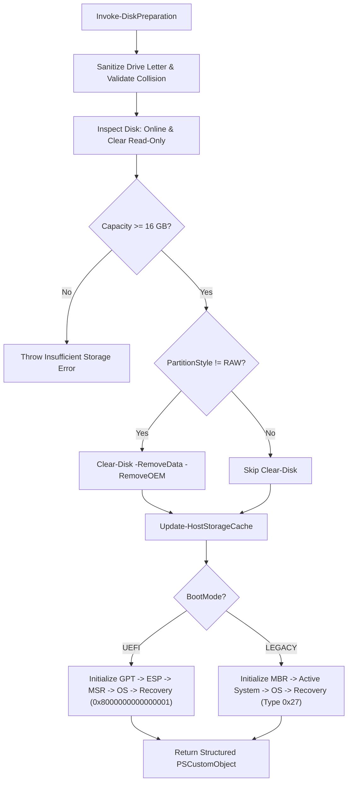

# LiteDeploy Disk Preparation Module Documentation

**Script File**: `Engine\Scripts\Runtime\050-DiskPreparation\LiteDeploy.DiskPreparation.ps1`  
**Documentation File**: `Engine\Scripts\Runtime\050-DiskPreparation\README.md`  
**Target Environment**: Windows PE (WinPE 5.1 / 10 / 11)  
**PowerShell Version**: PowerShell 5.1+ (`Set-StrictMode -Version 2.0`)  

---

## 1. Overview & Purpose

`LiteDeploy.DiskPreparation.ps1` is the bare-metal storage initialization and disk preparation engine for **LiteDeploy Core**.

It executes in WinPE prior to OS staging, translating workflow selection into certified disk layouts:
1. **Sanitizes & verifies disk readiness** — Handles offline disks, read-only SAN policies, and capacity boundaries.
2. **Wipes existing partitions** — Clears partition tables safely while updating host storage caches.
3. **Applies certified partition layouts** — Provisions standards-compliant partitions for **UEFI (GPT)** or **LEGACY (MBR)** boot architectures.
4. **Configures file systems & attributes** — Formats volumes (FAT32/NTFS), applies volume labels, and stamps Microsoft Windows Recovery Environment (WinRE) flags.
5. **Returns a structured handoff contract** — Supplies partition indexes and staging drive letters for downstream imaging (`dism /Apply-Image`), boot configuration (`bcdboot`), and recovery staging (`reagentc`).

---

## 2. Component Metadata

```powershell
Get-LiteDeployComponentMetadata
```

| Property | Value |
| :--- | :--- |
| **ComponentId** | `DiskPreparation` |
| **Name** | `LiteDeploy Disk Preparation` |
| **Version** | `1.0.0` |
| **Category** | `Runtime` |
| **TargetEnvironment** | `WinPE` |
| **MinPowerShellVersion** | `5.1` |
| **Author** | `LiteDeploy Team` |
| **Dependencies** | `LogWriter` |

---

## 3. Parameters

| Parameter | Type | Default | Description |
| :--- | :--- | :--- | :--- |
| `-DiskNumber` | `[int]` | `0` | Physical disk index targeted for wiping and partitioning. |
| `-BootMode` | `[string]` | `"UEFI"` | Target firmware boot mode. Validated values: `"UEFI"` or `"LEGACY"`. |
| `-OSTempDriveLetter` | `[string]` | `$null` | Temporary staging drive letter in WinPE (e.g., `"W"` or `"W:"`). If omitted, the OS volume remains unmounted. |
| `-Metadata` | `[switch]` | `$false` | Fast-exit switch returning standardized component metadata PSCustomObject. |

---

## 4. Partition Layout Architecture

### A. UEFI / GPT Partition Layout

```text
+---------------------+-------------------+-----------------------------------+--------------------+
|  1. ESP (500 MB)    |  2. MSR (16 MB)   |  3. Windows OS (Remaining Size)   |  4. WinRE (1024 MB)|
|  FAT32 - "System"   |  Unformatted      |  NTFS - "Windows" (e.g., W:)      |  NTFS - "Recovery" |
+---------------------+-------------------+-----------------------------------+--------------------+
```

| Partition | Size | Type / GUID | File System | Label | Attributes / Flags |
| :--- | :--- | :--- | :--- | :--- | :--- |
| **1. ESP** | 500 MB | `{c12a7328-f81f-11d2-ba4b-00a0c93ec93b}` | FAT32 | `System` | Hidden, No Drive Letter |
| **2. MSR** | 16 MB | `{e3c9e316-0b5c-4db8-817d-f92df00215ae}` | None | None | Reserved |
| **3. OS** | Remainder | Basic Data Partition | NTFS | `Windows` | Mounted as `$OSTempDriveLetter` or unmounted |
| **4. Recovery**| ~1024 MB | `{de94bba4-06d1-4d40-a16a-bfd50179d6ac}` | NTFS | `Recovery` | GPT Attributes: `0x8000000000000001`<br>(Required + No Default Drive Letter) |

> [!NOTE]
> Positioning the WinRE recovery partition at the end of the disk with a 1024MB reservation prevents Windows Update servicing failures (such as KB5034441) and allows safe partition expansion.

---

### B. LEGACY / MBR Partition Layout

```text
+----------------------------+-----------------------------------+--------------------+
|  1. System Reserved (500MB)|  2. Windows OS (Remaining Size)   |  3. WinRE (1024 MB)|
|  Active - NTFS             |  NTFS - "Windows" (e.g., W:)      |  NTFS - Type 0x27  |
+----------------------------+-----------------------------------+--------------------+
```

| Partition | Size | MBR Type | File System | Label | Attributes / Flags |
| :--- | :--- | :--- | :--- | :--- | :--- |
| **1. System Reserved** | 500 MB | `0x07` | NTFS | `System Reserved` | Active (`IsActive = $true`) |
| **2. OS** | Remainder | `0x07` | NTFS | `Windows` | Mounted as `$OSTempDriveLetter` or unmounted |
| **3. Recovery** | ~1024 MB | `0x27` | NTFS | `Recovery` | MBR Type `0x27` (Hidden Recovery) |

> [!TIP]
> Windows cannot format an existing `0x27` hidden recovery volume. The script creates the partition as `0x07` NTFS, formats the file system, and then alters the partition table type to `0x27` using `Set-Partition`.

---

## 5. Safety & Execution Controls



1. **`Set-StrictMode -Version 2.0`**: Prevents accidental `$null` variable evaluations, misspelled parameters, or invalid method invocations from executing against disks.
2. **Automated Offline & Read-Only Handling**: Resolves WinPE SAN policy blocks before executing partition modification.
3. **Drive Letter Sanitization**: Safely trims trailing slashes and colons (e.g., input `"W:\"` cleanly parses as character `'W'`), warning if the requested letter is already in use.
4. **DiskPart Error Trapping**: Intercepts both process exit codes and stdout text when assigning GPT recovery flags, preventing silent attribute assignment failures.

---

## 6. Output Contract

Upon successful initialization, `LiteDeploy.DiskPreparation.ps1` returns a structured `PSCustomObject`:

```powershell
[PSCustomObject]@{
    Success                 = $true
    BootMode                = "UEFI"        # "UEFI" or "LEGACY"
    DiskNumber              = 0
    OSPartitionNumber       = 3             # 3 (UEFI) or 2 (LEGACY)
    OSDriveLetter           = "W:"          # "W:" or $null
    SystemPartitionNumber   = 1             # 1 (ESP or System Reserved)
    RecoveryPartitionNumber = 4             # 4 (UEFI) or 3 (LEGACY)
    TotalSizeGB             = 476.94
}
```

### Downstream Pipeline Consumption

* **OS Image Staging**: `dism.exe /Apply-Image /ImageFile:Z:\Install.wim /Index:1 /ApplyDir:$result.OSDriveLetter`
* **Boot Environment Creation**: `bcdboot "$($result.OSDriveLetter)\Windows" /s S: /f $result.BootMode`
* **Recovery Staging**: Mounts `$result.RecoveryPartitionNumber` to stage `winre.wim` and register with `reagentc /setreimage`.

---

## 7. Usage Examples

### Fast Component Discovery
```powershell
.\LiteDeploy.DiskPreparation.ps1 -Metadata
```

### Partitioning Primary Disk for UEFI Deployment
```powershell
$formatResult = .\LiteDeploy.DiskPreparation.ps1 -DiskNumber 0 -BootMode UEFI -OSTempDriveLetter W
Write-Host "OS Staged on Partition $($formatResult.OSPartitionNumber) at $($formatResult.OSDriveLetter)"
```

### Legacy MBR Deployment without Drive Letter Mounting
```powershell
$formatResult = .\LiteDeploy.DiskPreparation.ps1 -DiskNumber 0 -BootMode LEGACY
```
