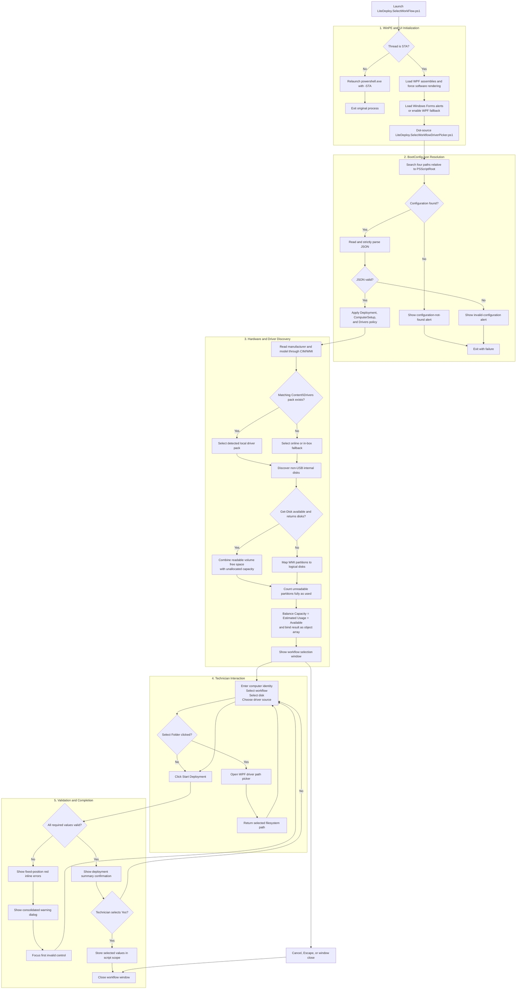
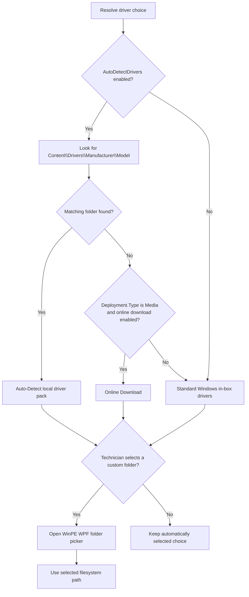
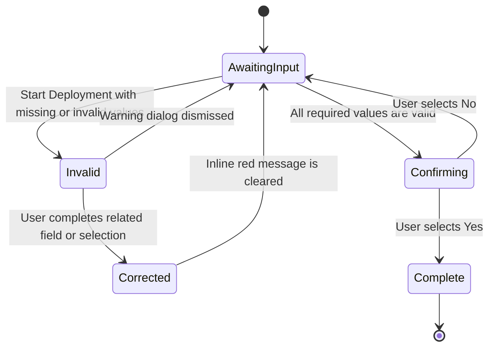

# LiteDeploy Workflow Selection Execution and Architecture Flowchart

This document visualizes the execution lifecycle, configuration resolution, hardware discovery, user selections, validation, and result handling of **[LiteDeploy.SelectWorkFlow.ps1](LiteDeploy.SelectWorkFlow.ps1)** and **[LiteDeploy.SelecWorkflowDriverPicker.ps1](LiteDeploy.SelecWorkflowDriverPicker.ps1)**.

---

## Main execution flow



---

## Driver-selection precedence



---

## Validation state behavior



The inline validation rows have fixed height and use `Hidden` instead of `Collapsed`. This preserves layout position whether an error is visible or cleared.

---

## Configuration path priority

```text
<ScriptRoot>\..\01-Config\BootConfig.json
              ↓ if missing
<ScriptRoot>\Config\BootConfig.json
              ↓ if missing
<ScriptRoot>\BootConfig.json
              ↓ if missing
Show alert and terminate
```

This matches the resolution order used by `components\06-PreCheck\LiteDeploy.PreCheck.ps1`.
