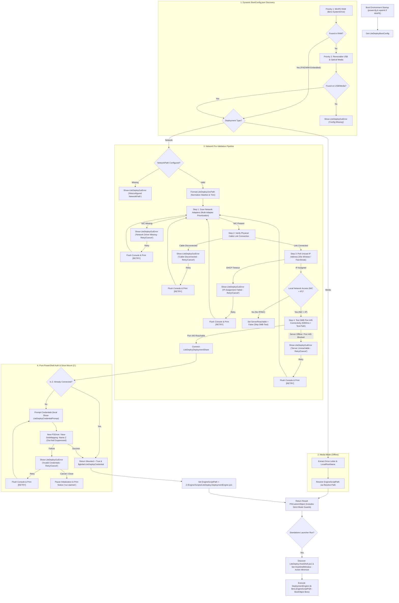

# LiteDeploy WinPE Initialization Engine Documentation

**Script**: `components\Runtime\BootInitializer\LiteDeploy.BootInitilizer.ps1`  
**Documentation File**: `components\Runtime\BootInitializer\README.md`  
**Target Environment**: Windows PE (WinPE 5.1 / 10 / 11) & Windows Host  
**PowerShell Version**: PowerShell 5.1+ (`Set-StrictMode -Version 2.0`)  

---

## 1. Overview & Purpose

`LiteDeploy.BootInitilizer.ps1` is the core initialization, configuration discovery, network validation, interactive authentication, and SMB share mounting engine for **LiteDeploy**.

The WinPE ISO or `Boot.wim` that launches this script is built with [WinPEBuilder](https://github.com/cmartinezone/WinPEBuilder) for USB/ISO media or WDS/PXE.

It may discover a **bootstrap** `BootConfig.json` on the boot WIM (`$env:SystemDrive`) for Type / NetworkPath, performs network hardware & IP checks (when `DeploymentType` is `"Network"`), verifies deployment server reachability over SMB Port 445, prompts for share credentials with a **local** Viewbox-scaled WPF dialog (native `Get-Credential` fallback), mounts the remote deployment share to drive **`Z:\`** (or locates USB/ISO for Media), **promotes** the full runtime `BootConfig.json` from that environment into `BootObject` (`Config`, `ConfigPath`, `DeploymentRoot`), discovers `LiteDeploy.HostShell.ps1`, minimizes the console shell, and launches the deployment engine (`LiteDeploy.DeploymentEngine.ps1`) with that in-memory `BootObject`.

BootInitializer cannot load [UiHost](../UiHost) or [LogWriter](../LogWriter) from the deployment share: those files are not reachable until after `Z:` is mapped. Logging (`Write-LiteDeployLog`) and the credential dialog (`Show-LiteDeployCredentialPrompt`) are therefore self-contained in this script. After the share is mounted, PreCheck / SelectWorkflow / Progress use UiHost from `Engine\Scripts`.

---

## 2. Architecture & Execution Flow



---

## 3. Configuration Discovery Priority Hierarchy

`Get-LiteDeployBootConfig` searches for `BootConfig.json` across locations in strict priority order. Internal fixed SATA, NVMe, and RAID disks are excluded to avoid consuming staging configs from previous OS installations.

| Priority | Scope | Description & Scanned Paths |
| :--- | :--- | :--- |
| **Priority 1 (Highest)** | **WinPE RAM (`$env:SystemDrive`)** | Bootstrap `BootConfig.json` on the boot WIM (Type + NetworkPath only). |
| **Priority 2** | **Loaded environment** | After mount (Network `Z:`) or USB/ISO discovery (Media), **promote** the full runtime `BootConfig.json` from the deployment source. Downstream scripts (engine, PreCheck, SelectWorkflow) consume this in-memory config — not the boot-image copy. `BootObject.DeploymentRoot` is the share/media folder that contains `Content\`. |

---

## 4. Pre-Validation Engine Checklist

When `Deployment.Type` is `"Network"` and `NetworkPath` is configured, the script executes an interactive 4-step pre-validation pipeline:

1. **Network Hardware Recognition & Multi-Adapter Prioritization**:
   * Scans active physical, USB, or virtual Ethernet network cards via `Get-NetAdapter` and `.NET` `NetworkInterface::GetAllNetworkInterfaces()`.
   * Automatically prioritizes any adapter with an active link (`Status -eq 'Up'`).
   * **Failure Action**: Triggers an interactive GUI Retry/Cancel dialog titled *"LiteDeploy - Network Driver Missing"*. Clicking **Retry** re-initializes WinPE networking (`wpeutil InitializeNetwork`) and re-scans hardware; clicking **Cancel** pauses initialization and drops to the WinPE shell.
2. **Physical Cable Link State Verification**:
   * Instantly verifies physical link connectivity (`MediaConnectionState -eq 'Connected'` / `OperationalStatus -eq 'Up'`).
   * **Failure Action**: Triggers an interactive GUI Retry/Cancel dialog titled *"LiteDeploy - Network Cable Disconnected"*. Clicking **Retry** re-evaluates physical link state; clicking **Cancel** pauses initialization and drops to the WinPE shell.
3. **IPv4 / IPv6 Address Assignment (30s Adaptive Polling)**:
   * Polls for assigned IPv4 or IPv6 unicast addresses for up to 30 seconds (ideal for enterprise Spanning Tree Protocol switches).
   * Filters out loopback (`127.0.0.1`, `::1`), APIPA (`169.254.x.x`), and IPv6 link-local (`fe80::*`).
   * **Instant Early Exit**: As soon as an IP is detected (e.g. at 1.5s), the loop breaks **immediately** without waiting for the remaining 30 seconds.
   * **Failure Action**: Triggers an interactive GUI Retry/Cancel dialog titled *"LiteDeploy - IP Address Assignment Failed"*.
4. **`NetworkPath` Validation & Universal Path Normalization**:
   * Accepts both forward slash and backslash formats in `BootConfig.json` (e.g. `"/X1/DeploymentShare$"`, `"//X1/DeploymentShare$"`, or `"\\\\X1\\DeploymentShare$"`).
   * Automatically normalizes any path to standard Windows UNC (`\\X1\DeploymentShare$`).
   * Tests TCP 445 socket connectivity to the deployment server via `.NET` `TcpClient` with a 5000ms timeout and `Test-Path` fallback for WinPE DNS lookup delays.
   * **Failure Action**: Triggers an interactive GUI Retry/Cancel dialog titled *"LiteDeploy - Server Unreachable"* displaying the target server name and `NetworkPath`.

---

## 5. Pure Native PowerShell Credential & Drive Mapping (`Z:\`)

* **100% Pure PowerShell**: Uses native PowerShell cmdlets (`New-PSDrive` and `New-SmbMapping`) for persistent SMB mapping.
* **Interactive Retry Loop**: Prompts for credentials via the **boot-local** `Show-LiteDeployCredentialPrompt` in this script (Viewbox-scaled, show-password toggle, returns `PSCredential` / `SecureString`). Does not load UiHost — the share is not mounted yet. If WPF or STA is unavailable, falls back to native `Get-Credential`. If authentication fails, pops up a Windows Forms **Retry / Cancel** GUI dialog titled *"LiteDeploy - Authentication Failure"*. Clicking **Retry** re-prompts until successful or cancelled.
* **Graceful Cancellation Guidance**: If the user closes or cancels any prompt, initialization pauses cleanly with clear console instructions:
  `[NOTICE] Deployment initialization paused.`
  `To restart this process, run 'startnet' below.`
* **System-Wide SMB Access**: Under the hood, `-Persist` registers the authenticated SMB session with the Windows `MPR` / `WNet` Kernel driver. All child PowerShell processes, CMD windows, DISM commands, and `PreCheck.ps1` inherit access to `Z:\`.

---

## 6. Function Reference

### `Write-LiteDeployLog`
Outputs color-coded text live to the console screen and appends official Microsoft CMTrace.exe XML formatted entries to `X:\~LiteDeploy\WorkLogs\LiteDeploy.Execution.log`.
```powershell
Write-LiteDeployLog -Message "IP Address Assigned: 192.168.1.50" -Level "SUCCESS" -ForegroundColor Green -Component "BootInitilizer"
```

### `Format-LiteDeployUncPath`
Normalizes any slash combination (`/` or `\`) or trailing slashes to standard Windows UNC path syntax (`\\Server\Share$`).
```powershell
$uncPath = Format-LiteDeployUncPath -Path "//Server/DeploymentShare$/"
# Returns "\\Server\DeploymentShare$"
```

### `Show-LiteDeployGuiError`
Displays Windows Forms GUI error dialogs (`MessageBox`) with `try/catch` fallback to console warning.
```powershell
Show-LiteDeployGuiError -Message "Error message text" -Title "LiteDeploy Error" -IsRetryDialog:$false
```

### `Resolve-LiteDeployEnginePath`
Resolves `LiteDeploy.DeploymentEngine.ps1` from production `Engine\Scripts` siblings or this repo's `components/Runtime/DeploymentEngine`.
```powershell
$enginePath = Resolve-LiteDeployEnginePath -RootPath "Z:"
# Returns "...\LiteDeploy.DeploymentEngine.ps1"
```

### `Test-LiteDeployNetworkHardware`
Scans for active network interface cards and prioritizes connected adapters.
```powershell
$nic = Test-LiteDeployNetworkHardware
# Returns [PSCustomObject]@{ AdapterFound = $bool; AdapterName = $str; IsLinkConnected = $bool }
```

### `Test-LiteDeployIPAddress`
Polls for assigned IPv4/IPv6 addresses with instant early exit on IP detection.
```powershell
$ipInfo = Test-LiteDeployIPAddress -TimeoutSeconds 30
# Returns [PSCustomObject]@{ IPAddress, IPv4Address, IPv6Address, HasValidIP }
```

### `Test-LiteDeployDeploymentShare`
Tests SMB TCP Port 445 server reachability with 5000ms timeout and `Test-Path` UNC fallback.
```powershell
$shareInfo = Test-LiteDeployDeploymentShare -SharePath "\\Server\DeploymentShare$" -TimeoutMs 5000
# Returns [PSCustomObject]@{ Reachable = $bool; Server = "Server" }
```

### `Show-LiteDeployCredentialPrompt`
Boot-local WPF credential dialog (same contract as `Get-Credential`: user name + `SecureString` → `PSCredential`). Lives in this script because UiHost is on the deployment share, which is not available until after mount. Accepts `-Theme Light|Dark` (default Light). Colors match the UiHost palette.

### `Resolve-LiteDeployUiTheme`
Reads `Light` / `Dark` from BootConfig when present. Preferred key is `Ui.Theme` (reserved for a later BootConfig field). Also accepts `Metadata.Theme`, `Startup.Theme`, or a top-level `Theme`. Invalid or missing values default to `Light`. Bootstrap BootConfig can set this for the pre-mount credential prompt; the loaded-environment BootConfig can override it for PreCheck / SelectWorkflow after promote.

### `Get-LiteDeployShareCredential`
Shows the boot-local `Show-LiteDeployCredentialPrompt` using the resolved theme. Falls back to `Get-Credential` if WPF is missing or the host is not STA.
```powershell
$cred = Get-LiteDeployShareCredential -NetworkPath "\\Server\DeploymentShare$"
# Returns PSCredential, or $null / throws if the technician cancels
```

### `Connect-LiteDeployDeploymentShare`
Handles interactive credential prompting, authentication retry loop, pipeline leak suppression, and `Z:\` drive mapping using pure PowerShell.
```powershell
$mountRes = Connect-LiteDeployDeploymentShare -NetworkPath "\\Server\DeploymentShare$" -DriveLetter "Z:" -ShowGuiError
# Returns [PSCustomObject]@{ Mounted, DriveLetter, NetworkPath, Credential }
```

### `Get-LiteDeployBootConfig`
Primary discovery and validation engine function. Returns a `[PSCustomObject]` with strict-mode property protection. After the source is loaded, `Config` / `ConfigPath` are the **runtime** BootConfig and `DeploymentRoot` is the share or USB folder that contains `Content\`.
```powershell
$bootObj = Get-LiteDeployBootConfig -ConfigPath "" -MountShare -ShowGuiError
# Config, ConfigPath, DeploymentRoot, DriveLetter, LocalRootName, EngineScriptPath, Credential, Theme, …
```

---

## 7. Integration & Standalone Execution

### Standalone Execution
When executed directly (not dot-sourced), `LiteDeploy.BootInitilizer.ps1`:
1. Executes `Get-LiteDeployBootConfig`.
2. Extracts `$bootObj` with `Set-StrictMode 2.0` property protection.
3. Logs all checks, status, warnings, and errors to `X:\~LiteDeploy\WorkLogs\LiteDeploy.Execution.log` (CMTrace XML) and `X:\~LiteDeploy\WorkLogs\LiteDeploy.Execution.json` (NDJSON).
4. Verifies presence of the deployment engine (`LiteDeploy.DeploymentEngine.ps1`).
   * **If Missing**: Logs `[ERROR] Engine script not found...`, displays GUI error dialog titled *"LiteDeploy - Script Missing"*, and pauses initialization cleanly.
   * **If Present**: Discovers `LiteDeploy.HostShell.ps1`, minimizes the host console, and executes `& $enginePath -BootObject $bootObj`. The engine then runs PreCheck and SelectWorkflow in the same process.
5. Restores host shell window on completion or error.

---

## 8. Logging & Diagnostics Standard

* **Master Log Files**: `X:\~LiteDeploy\WorkLogs\LiteDeploy.Execution.log` and `X:\~LiteDeploy\WorkLogs\LiteDeploy.Execution.json`
* **Format**: 
  * **CMTrace XML**: Native XML Schema (`type="1"` Info/Success, `type="2"` Warning/Retry, `type="3"` Error).
  * **Structured NDJSON**: Single-line compressed JSON objects (`timestamp`, `level`, `type`, `component`, `message`, `file`).
* **Multi-Destination Output**: `Write-LiteDeployLog` writes live colored text to the console screen while simultaneously appending timestamped CMTrace XML lines to `LiteDeploy.Execution.log` and NDJSON objects to `LiteDeploy.Execution.json`.
* **Single Startup Banner**: Title banners (`======...`, `LiteDeploy WinPE Initialization Engine v1.0`, `======...`) appear **exactly once at initial script startup**. Screen clears (`Clear-Host`) and duplicate title headers inside retry loops are completely eliminated.
* **Standardized Bracket Tags**: All console and log entries use aligned bracketed prefixes:
  * ` [INIT]    ` — WinPE environment setup & power plan activation (`type="1"`)
  * ` [CHECK]   ` — Discovery and pre-validation check prompts (`type="1"`)
  * ` [SUCCESS] ` — Successful discovery, connection, or hardware detection (`type="1"`)
  * ` [INFO]    ` — Configuration mode and path parameter details (`type="1"`)
  * ` [WARNING] ` — Recoverable issues such as disconnected cable or DHCP timeout (`type="2"`, Yellow)
  * ` [RETRY]   ` — Re-scanning hardware, polling link/IP, or re-prompting credentials (`type="2"`, Yellow)
  * ` [ERROR]   ` — Unrecoverable errors or authentication failures (`type="3"`, Red)
* **100% History Retention**: Every event—including success states, fast-path checks, authentication failures, retries, and cancellation pauses—is recorded persistently in both log targets.
* **Specification Document**: Full details, component tags, and code examples are documented in [LogWriter README](../LogWriter/README.md).
