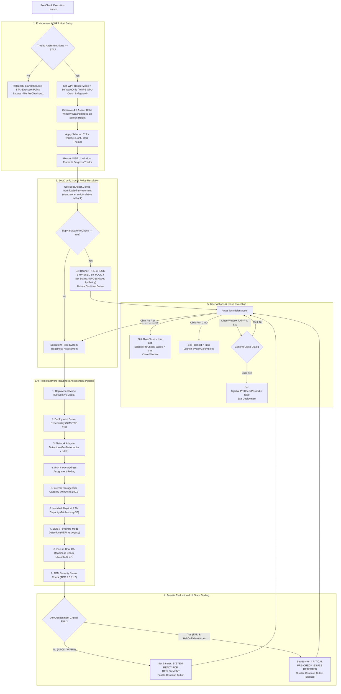

# LiteDeploy Pre-Check Execution & Architecture Flowchart

This document provides a dedicated visual flowchart detailing the complete execution lifecycle, environment initialization, configuration resolution, 9-point assessment pipeline, and UI state handling of **[LiteDeploy.PreCheck.ps1](LiteDeploy.PreCheck.ps1)**.

---

## 📊 Pre-Check Execution Flowchart

---

## 📑 Workflow Section Descriptions

### 1. Environment & WPF Host Setup
* **STA Relaunch Guard**: Detects if the current PowerShell host thread is running in Single-Threaded Apartment (STA) mode. If not, it transparently relaunches itself using `powershell.exe -STA`.
* **Software Rendering**: Enforces `[RenderOptions]::ProcessRenderMode = SoftwareOnly` to eliminate GPU driver crashes in WinPE RAMDisk environments.
* **Dynamic Scaling & Themes**: Dynamically computes 4:3 viewbox scaling based on primary monitor height ($75\%$ height scaling) and applies theme brushes (`Light` or `Dark`).
* **BootObject Storage**: Accepts an optional `[psobject]$BootObject` from `LiteDeploy.DeploymentEngine` / BootInitializer and holds it in `$BootObject` and `$global:LiteDeployBootObject`. On Continue, PreCheck returns `{ ContinueRequested, PreCheckPassed, Status }` to the engine; it does not launch SelectWorkflow.

### 2. Configuration Resolution & Policy Bypass
* Uses `BootObject.Config` promoted from the loaded share/USB. Standalone only falls back to script-relative `BootConfig.json`.
* If `Startup.SkipHardwarePreCheck` is set to `true`, hardware checks are bypassed, an `INFO` badge is logged, and the deployment is immediately unlocked.

### 3. The 9-Point Assessment Pipeline
1. **Deployment Mode**: Identifies whether the run is `Network` or `Media` (Offline).
2. **Deployment Server**: Tests SMB TCP Port 445 connectivity to the deployment server.
3. **Network Adapter**: Scans for active physical Ethernet adapters.
4. **IP Address**: Polls for a valid non-APIPA IPv4/IPv6 address.
5. **Hard Drive**: Scans internal fixed drives against `-MinDiskSizeGB`.
6. **System RAM**: Compares installed RAM against `-MinMemoryGB` with VM WMI OS fallback.
7. **BIOS Mode**: Queries `UEFI` vs `Legacy BIOS` state.
8. **Secure Boot**: Queries UEFI Secure Boot CA database (`Get-SecureBootUEFI db`) for 2011/2023 CAs.
9. **TPM Status**: Evaluates TPM 2.0 / 1.2 version and state (`OK` or non-blocking `WARN`).

### 4. Results Evaluation & Close Protection
* **HaltOnFailure Enforcement**: Disables the **Continue** button (`Blocked`) if any required check fails when `-HaltOnFailure $true` is set.
* **Confirmation Modal**: Intercepts `Alt+F4`, `Escape`, or window `X` clicks to prevent accidental deployment cancellation.
