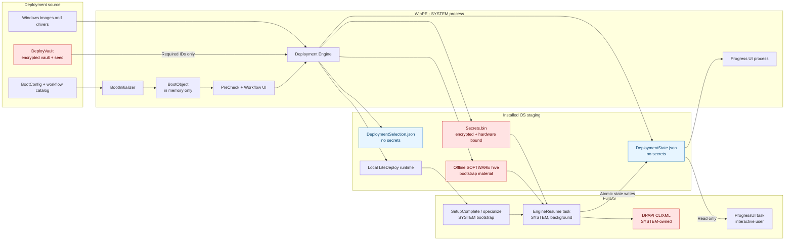
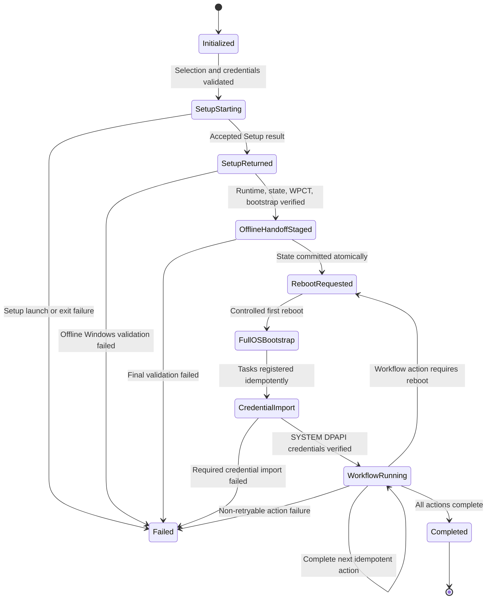
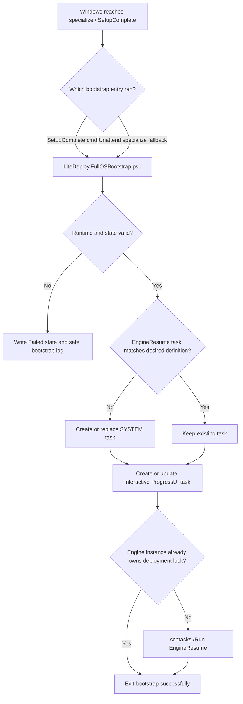

# LiteDeploy Deployment Architecture Diagrams

Status: **Planned architecture; not yet fully implemented.**

See [LITEDEPLOY_DEPLOYMENT_PLAN.md](LITEDEPLOY_DEPLOYMENT_PLAN.md) for the technical specification and acceptance criteria.

## 1. End-to-end sequence

```mermaid
sequenceDiagram
    autonumber
    participant Startnet as startnet.cmd
    participant Boot as BootInitializer<br/>WinPE parent
    participant Pre as PreCheck UI
    participant Select as Workflow UI
    participant EnginePE as Deployment Engine<br/>WinPE
    participant Vault as DeployVault / WPCT
    participant ProgressPE as Progress UI<br/>WinPE process
    participant Setup as Windows Setup
    participant Offline as Offline Windows
    participant SC as SetupComplete /<br/>specialize fallback
    participant Task as EngineResume<br/>SYSTEM task
    participant ProgressOS as ProgressUI<br/>interactive task

    Startnet->>Boot: Launch PowerShell 5.1 STA shell
    Boot->>Boot: Load config, network, share credential
    Boot->>Pre: Invoke with BootObject
    Pre-->>Boot: Structured PreCheck result
    alt Failed or cancelled
        Boot->>Boot: Stop without changing disk
    else Passed and Continue
        Boot->>Select: Invoke with BootObject
        Select-->>Boot: Structured deployment selection
    end
    alt Selection cancelled
        Boot->>Boot: Stop without changing disk
    else Deployment requested
        Boot->>EnginePE: Start orchestration with BootObject + selection
        EnginePE->>EnginePE: Revalidate disk, image, drivers, workflow
        EnginePE->>Vault: Resolve only required credential IDs
        Vault-->>EnginePE: In-memory PSCredential map
        EnginePE->>EnginePE: Generate non-secret Unattend.xml and state
        EnginePE->>ProgressPE: Start separate progress reader
        EnginePE->>Setup: Start /NoReboot and wait
        Setup-->>EnginePE: Exit code; first reboot suppressed
        EnginePE->>Offline: Locate Windows volume and stage runtime/state
        EnginePE->>Vault: Create hardware-bound Secrets.bin + offline registry bootstrap
        EnginePE->>Offline: Stage SetupComplete and specialize fallback
        EnginePE->>Offline: Verify every handoff artifact
        EnginePE->>EnginePE: State = RebootRequested
        EnginePE->>Setup: wpeutil reboot
    end
    Setup->>SC: First FullOS boot invokes bootstrap
    SC->>SC: Register tasks idempotently
    SC->>Task: Start EngineResume immediately
    Task->>Vault: Import WPCT package under SYSTEM DPAPI
    Vault-->>Task: CredentialId.xml files
    Task->>Task: Resume workflow at first incomplete action
    Task->>Offline: Atomically update DeploymentState.json
    Note over Task,ProgressOS: SYSTEM task is background-only;<br/>it does not host the visible WPF window.
    Setup->>ProgressOS: Interactive user logon triggers UI task
    ProgressOS->>Offline: Read DeploymentState.json
    loop Until terminal state
        Task->>Offline: Write action/percentage/status
        ProgressOS->>Offline: Poll and render current state
    end
    Task->>Task: State = Completed; clean credentials and task
    ProgressOS->>ProgressOS: Show completion and exit
```

## 2. Trust and process boundaries



## 3. Durable state transitions



## 4. FullOS bootstrap decision flow



## 5. Reboot ownership

```text
WinPE Setup launch
    |
    | setup.exe /NoReboot
    v
Setup returns to LiteDeploy
    |
    | stage + validate runtime, state, credentials, and bootstrap
    v
LiteDeploy requests FIRST reboot with wpeutil
    |
    v
Windows Setup controls its later installation reboots
    |
    v
FullOS EngineResume controls only workflow-requested reboots
```

`/NoReboot` suppresses only the first Windows Setup reboot. The FullOS resume state must therefore already exist before LiteDeploy calls `wpeutil reboot`.

